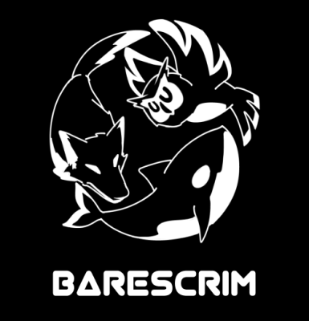

<h1 align="center">CAVELY by Barescrim</h1>

 

## Cara Menggunakan
1. Clone source code pada halaman ini
2. Buat database baru pada MariaDB/MySQL (dapat menggunakan phpMyAdmin)
3. Pada database baru, import game_publisher.sql
4. Composer yang digunakan mengharuskan php versi 8.2 atau lebih, pastikan php yang dipilih pada Laragon sesuai atau update versi php pada Linux.
5. Penjalanan program **HARUS MELALUI TERMINAL**, penjalanan melalui Laragon akan mengakibatkan error pada beberapa bagian.
6. Atur isi file .env agar sesuai (terutama pada bagian nama database, username, dan password).